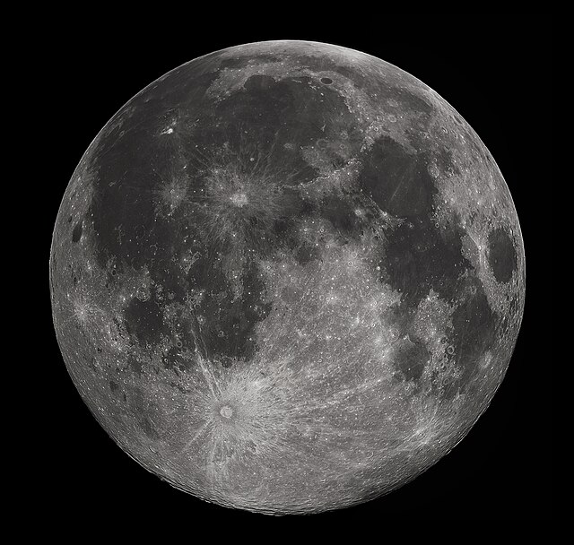

-e % Описание Луны

-e Луна

Луна — единственный естественный спутник Земли. Это второй по яркости объект на земном небосводе после Солнца и пятый по величине естественный спутник планеты в Солнечной системе.

Луна находится в синхронном вращении с Землёй, поэтому она всегда обращена к нашей планете одной и той же стороной.
